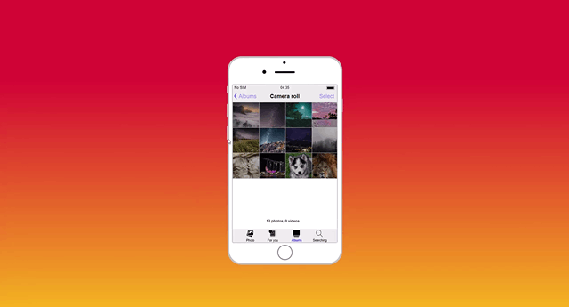

# iPhone clone 📱

> Remember what the iPhone was like in 2016 🙌

### See the <a href='https://dnt-knw.github.io/iPhone-clone' target='_blank' title='Click to open the project'>Demo</a> 👁

## ❗️ Important ❗️

This is __not an emulator__ and __not a simulator__, it's just an __imitation of interaction__ with the __custom iPhone widgets__ I made myself via JS.
The performance and implementation of this project leaves much to be desired. This is __my old project__, but it's still __interesting__ and __deserves attention__

## Description 📖
This project contains __almost all the basic iPhone widgets and pages__ that you can interact with

- 📄 39 Widgets
- 📄 58 Pages

Not all widgets have functionality, some of them are static
    
## Where to start ❓

- 📜 Tap the "Home" button in order to turn on the screen
- 📜 Tap it again in order to open the input in the locked screen
- 📜 You will get a passcode in the alert, put it into the input
- 📜 Click the "Done" button
- 📜 To see more widgets tap on left / right screen side
    
## Which widgets you can interact with and what you can do ❓

- 📜 Check today's date and month in the "Calendar"
- 📜 Viewing photos in the "Photos"
- 📜 Switching camera mode in the "Camera"
- 📜 Disclose additional info in the "Maps"
- 📜 Check the time, turn on alarms and bedtime in the "Clock"
- 📜 Create and delete notes in the "Notes"
- 📜 Create and delete reminders and scheduled tasks in the "Reminders"
- 📜 Dial and erase a phone number in the "Phone"
- 📜 Use calculator in the "Calculator"
- 📜 Open "Extras" in order to see the widgets it has
- 📜 Interact and open them as well
    
## Additional info 📝

- 📲 iPhone model is 7 (iPhone 7)
- 📲 The cloned system: iOS 12
    
Try to open all the widgets and who knows, maybe you will find something else? 🙂
